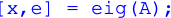
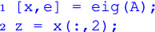

# LaTeX macros for Robotics, Vision and Control

This file includes macros to create equations in the style of those used in the textbook "Robotics, Vision & Control".

```latex
\include{rvc-notation}
```

Make sure that `rvc-notation.tex` is in your LaTeX path.

## Poses

* `\pose`        abstract pose, greek letter &xi;
* `\pose[f]`    pose with respect to a frame
* `\pose_A` is the pose of frame A
* `\pose[B]_A` is the pose of frame A with respect to frame B
* `\estpose`  estimated pose, greek letter &xi; with hat
* `\posedot`   derivative of abstract pose, greek letter &nu;
A leading superscript, the reference frame, is specified in square brackets.  A trailing subscript, the target frame, is specified in the standard LaTeX way using `_`.

The operators &oplus; and &ominus; which are given by the LaTeX commands `\oplus`  and `\ominus` respectively.

```\latex
$\ominus \pose[C]_A = \pose[A]_B \oplus \pose[B]_C$
```


We can apply a pose to a vector, which linearly transforms it by

```\latex
$\pose_b \sbullet \vec{b}_P$
```

You can tweak the size of the bullet by giving it a relative scale argument, ie. `\sbullet[2]` is very large.

There are also estimated pose and derivative of pose or spatial velocity

```\latex
$\estpose, \posedot$
```


## Coordinate frames

* `\cframe{A}` is coordinate frame A which renders as {A}

```latex
\cframe{A}
```


## Points

* `\point{A}` is point A which renders in Roman bold font

```latex
\point{P}
```


## Vectors

Vectors are displayed in bold italic font

* `\vec{t}` is a vector t 
* `\vec[A]{t}` is a vector t with respect to frame A
* `\dvec{t}` is vector of `\dot{t}`
* `\dvec[A]{t}` is vector of `\dot{t}` with respect to frame A
* `\ddvec[f]{x`}  a double dotted vector 
* `\hvech[f]{x}` a homogeneous vector (tilde above)
* `\bvec[f]{x}` a vector with an over bar, eg. for mean value
* `\evec[f]{x}` an estimated vector with a hat

```latex
$\vec{v}, \dvec{v}, \ddvec{v}, \vec[a]{v}$
```


```latex
$ \hvec{v},  \evec{v}, \bvec{v}$
```


## Matrices

Matrices are displayed in bold Roman font

* `\mat{x}`     a matrix
* `\mat[f]{x}`  a matrix with a coordinate frame
* `\dmat[f]{x}`  a matrix derivative
* `\zero` a zero matrix
* `\matfn{f}{x}` matrix function f of x


```latex
$\mat{A}, \mat[a]{R}_b, \dmat{A}, \emat{A}, \zero_{2\times 3}$
```


```latex
$\matfn{J}{\vec{q}}, \matfn[0]{J}{\vec{q}}$
```


## Skew symmetric matrices

* `\skx{v}`  -> [v]x skew symmetric matrix
* `\sk{v}`  -> [v] augmented skew symmetric matrix
* `\iskx{v}`  -> inverse skew symmetric matrix, vex operator
* `\isk{v}`  -> inverse augmented skew symmetric matrix

```latex
$\sk{v}, \skx{v}, \isk{A}, \iskx{A}$
```


## Unit Quaternion

* `\q` displays as q with a bubble on top

```latex
$\q, \q[a]_b$
```


## Mathematial Groups

Displayed in Roman font

* `\R` is the group of real numbers, an R in blackboard font
* `\SO{n}`  special orthogonal group: SO(n)
* `\SE{n}`  special Euclidean group: SE(n)
* `\so{n}`  Lie algebra of SO(n): so(n)
* `\se{n}`  Lie algebra of SE(n): se(n)

```latex
$\R^2, \SO{3}, \so{3}$
```


## MATLAB code

Display a block of code in blue fixed-width font

```latex
\begin{Code}
[x,e] = eig(A);
\end{Code}
```


For multi-line code blocks with line numbering

```latex
\begin{CodeNum}
[x,e] = eig(A);
z = x(:,2);
\end{CodeNum}
```


## Miscellaneous

### Smallest angular difference
The symbol &circleddash; is used to represent the difference of two angles wrapped into the interval [-&pi; &pi;), which is produced by the LaTeX command `\circleddash`.

```latex
$\theta_1 \circleddash \theta_2$
```


### Units

* `\unit{U}` sets the contents in math mode with a preceding half space, eg. `\unit{m s^{-2})`
* `\mm`, `\um`, `\nm`
* `\Hz`, `\kHz`, `\MHz`
* `\ms`
* `\deg`

```latex
The object was 12\mm\ across, 
accelerated at 2.3\unit{m s^{-2}},
the servo interval was 12\ms, 
and the angle spanned 30\deg.
```


### Scientific notation

* `\sci{m}{e}` scientific notation with mantissa and exponent

```latex
\sci{5}{-2}
```


### Coordinates and vectors
```latex
$\coord{1}{2}, \vector{1}{2}{3}$
```


### Other symbols

* `\cspace` configuration space, caligraphic C